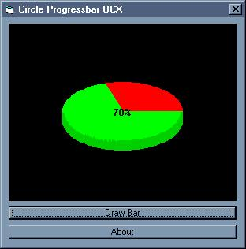



## Circle Progressbar v2\.0 \- ActiveX Control

### Description

The OCX to the all-famous (sort of) Circle Progressbar. this is version 2.0 so its better, i fixed the customization problem, made it faster (a little-bit) and included an example with it so you people know how to use it. please COMMENT and VOTE!!!!!!! (im hoping to get atleast on the list)
 
### More Info
 

             |
---                |---
**Submitted On**   |2002-04-01 16:44:18
**By**             |[poop\_4\_brains](https://github.com/Planet-Source-Code/PSCIndex/blob/master/ByAuthor/poop-4-brains.md)
**Level**          |Intermediate
**User Rating**    |3.8 (19 globes from 5 users)
**Compatibility**  |VB 6\.0
**Category**       |[Coding Standards](https://github.com/Planet-Source-Code/PSCIndex/blob/master/ByCategory/coding-standards__1-43.md)
**World**          |[Visual Basic](https://github.com/Planet-Source-Code/PSCIndex/blob/master/ByWorld/visual-basic.md)
**Archive File**   |[Circle\_Pro67507412002\.zip](https://github.com/Planet-Source-Code/poop-4-brains-circle-progressbar-v2-0-activex-control__1-33307/archive/master.zip)

